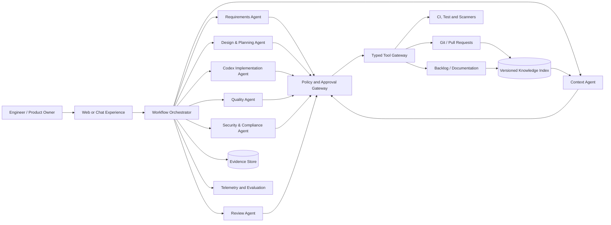

# Agentic SDLC Control Tower

## Proposal for the OpenAI Codex Flagship Hackathon

> **Scope note:** no use-case attachment or Cognizant event brief is present in this
> repository. This document therefore turns the stated theme—an agentic SDLC
> framework—into an implementation-ready reference proposal. Section 12 separates
> the recommended next actions from any Cognizant-specific instruction that still
> needs confirmation in the internal hackathon portal or organizer email.

## 1. Executive idea

Build an **Agentic SDLC Control Tower**: a human-governed engineering workflow in
which specialized agents help a delivery team move a work item from clarified
requirement to production-ready change. The agents use OpenAI Codex for repository
analysis and implementation, but they do not operate as an uncontrolled swarm.
Every action is constrained by policy, grounded in versioned project context,
recorded as evidence, and stopped at explicit risk-based approval gates.

The hackathon demonstration should follow one realistic user story through this
thin vertical slice:

1. ingest a story and acceptance criteria;
2. discover relevant code, standards, ownership, and prior decisions;
3. produce a risk-rated implementation plan;
4. make a change in an isolated branch/worktree;
5. generate and run tests and security checks;
6. explain the patch and create review evidence; and
7. open a draft pull request, requiring a human to approve merge or deployment.

This is more credible and valuable than trying to automate every SDLC phase in a
hackathon. It demonstrates an end-to-end business outcome while keeping blast
radius, evaluation cost, and integration effort manageable.

## 2. Problem and opportunity

Software teams lose time in handoffs: requirements are incomplete, repository
knowledge is fragmented, controls are checked late, and reviewers reconstruct the
reason for a change from scratch. Conventional copilots accelerate isolated coding
tasks but do not preserve intent or evidence across the lifecycle.

The proposed control tower optimizes **flow with trust**:

| Current friction | Agent-assisted behavior | Expected outcome |
|---|---|---|
| Ambiguous tickets reach development | Requirements agent identifies missing acceptance criteria and asks targeted questions | Less rework and clearer definition of ready |
| Engineers search across many systems | Context agent retrieves only authorized, task-relevant code and decisions | Faster onboarding and analysis |
| Tests and controls occur late | Quality and security agents derive checks from risk and acceptance criteria | Earlier defect discovery |
| Reviewers receive a large unexplained diff | Reviewer agent maps requirements to changed files, tests, risks, and evidence | Shorter, higher-quality review |
| Automation is difficult to audit | Orchestrator records prompts, tool calls, approvals, artifacts, and model/version metadata | Traceable delivery and easier governance |

The aim is **not head-count replacement**. The aim is to remove low-value search,
translation, and evidence-assembly work so people can focus on architecture,
product judgment, security exceptions, and final accountability.

## 3. Users and primary use case

### Personas

- **Product owner:** wants implementable stories and traceability to outcomes.
- **Developer:** wants repository-aware plans, safe edits, and fast feedback.
- **Reviewer/architect:** wants a concise rationale, risk summary, and evidence.
- **QA/security engineer:** wants controls applied consistently and exceptions made
  visible.
- **Engineering manager/auditor:** wants measurable flow and an immutable decision
  trail without exposing source code or secrets.

### Golden-path story

> Given a backlog item to add a configurable account-lockout threshold, the system
> identifies ambiguity in reset behavior, retrieves the authentication conventions,
> proposes a minimal design, changes the service and configuration schema, writes
> unit and negative tests, runs approved checks, and opens a draft pull request that
> traces every acceptance criterion to evidence.

The story is suitable because it is small enough for a demo but includes business
rules, configuration, security, testing, documentation, and human approval.

## 4. Solution architecture

### Architectural choices and reasons

1. **One orchestrator, bounded specialists.** A state machine owns transitions and
   retries; agents have narrow roles. This prevents circular delegation and makes
   failures reproducible.
2. **Repository instructions are authoritative.** The context hierarchy is ticket →
   repository guidance → architecture decisions → organization policy. Conflicts
   are surfaced rather than silently resolved.
3. **Typed tools, not arbitrary integrations.** Every operation has a schema,
   identity, scope, timeout, and auditable result. The implementation agent may edit
   its worktree and invoke allow-listed checks, but cannot merge or deploy.
4. **Artifacts connect phases.** Each stage produces a validated artifact such as a
   requirements contract, plan, patch, test report, threat note, or review packet.
   Downstream agents consume artifacts rather than relying on conversational memory.
5. **Risk drives autonomy.** Documentation-only, reversible changes can proceed to a
   draft PR automatically. Authentication, data migration, infrastructure,
   dependency, privacy, or production changes require specialist approval.
6. **Retrieval is permission-aware.** Chunking follows code symbols and document
   sections; results carry source, revision, owner, sensitivity, and freshness. The
   requesting user's authorization is enforced before retrieval, not after output.

## 5. Agent contracts

All agent outputs should be schema-validated JSON plus a human-readable rendering.
Every contract includes `work_item_id`, `repository_revision`, `correlation_id`,
`assumptions`, `sources`, `confidence`, and `requires_human_decision`.

| Agent | Reads | Produces | Must stop when |
|---|---|---|---|
| Requirements | Ticket, product rules | Acceptance criteria, questions, NFRs, definition of ready | Material ambiguity remains |
| Context | Approved repositories and knowledge | Ranked context manifest with revision and provenance | Access is denied or sources conflict |
| Design & Planning | Requirements, context | File-level plan, alternatives, risks, validation plan | High-impact architecture decision is needed |
| Codex Implementation | Approved plan and isolated worktree | Minimal patch, change log, local command evidence | Plan boundary is exceeded or secrets are detected |
| Quality | Criteria, diff, test conventions | Tests, coverage delta, failure classification | A nondeterministic or unexplained failure occurs |
| Security & Compliance | Diff, threat model, policies | Findings, severity, remediation, exception request | Critical/high finding or regulated-data impact exists |
| Review | All prior artifacts | Requirement-to-evidence matrix, residual risks, draft PR narrative | Evidence is incomplete or checks disagree |

Agents must never mark their own high-risk exception as approved. The orchestrator,
not the model, determines whether a required gate has passed.

## 6. End-to-end workflow

1. **Intake:** normalize the ticket, classify repository and data sensitivity, and
   assign a risk tier.
2. **Clarify:** generate testable Given/When/Then criteria, non-functional
   requirements, exclusions, and a short list of blocking questions.
3. **Ground:** retrieve relevant source symbols, tests, ownership rules, ADRs, and
   coding instructions at an immutable revision.
4. **Plan:** state the proposed delta, impacted interfaces, alternatives rejected,
   security considerations, rollback, and exact validation commands.
5. **Approve plan:** require a human for medium/high-risk work; log approver identity
   and artifact hash.
6. **Implement:** create an ephemeral branch/worktree, apply small changes, and
   continuously check scope and diff size.
7. **Verify:** run deterministic formatting, linting, type checks, unit/integration
   tests, dependency and secret scans, and applicable policy-as-code.
8. **Repair:** permit a small retry budget only for failures causally linked to the
   patch. Escalate repeated or environmental failures with evidence.
9. **Review:** create a draft PR containing rationale, screenshots when UI changes,
   acceptance-criteria mapping, commands and results, security findings, rollback,
   and known limitations.
10. **Human decision:** code owners review and merge through existing branch
    protection. Deployment remains in the organization's approved CI/CD process.
11. **Learn:** capture outcome signals—review changes, escaped defects, rollback,
    latency, and agent cost—without training on customer code by default.

## 7. Trust, security, and governance by design

Use established secure-SDLC and AI-risk principles rather than adding a generic
“responsible AI” stage at the end:

- **Least privilege:** short-lived credentials, user-delegated access, per-tool
  scopes, protected branches, and no direct production access.
- **Isolation:** ephemeral worktrees/containers, network egress allow-lists,
  resource/time limits, and sandboxed execution of repository code.
- **Prompt-injection defense:** treat repository text, issues, logs, and web content
  as untrusted data; instructions never inherit authority from retrieved content.
- **Data protection:** classify inputs, redact secrets and personal data, encrypt in
  transit/at rest, define retention, and prohibit sensitive content in telemetry.
- **Supply-chain safety:** pin actions and dependencies, generate an SBOM where
  applicable, verify provenance, scan licenses/vulnerabilities, and sign release
  artifacts through the existing pipeline.
- **Separation of duties:** the authoring agent cannot approve its output; code
  owners and security owners remain accountable for designated risk classes.
- **Fail closed:** tool denial, missing evidence, inconsistent results, or policy
  service failure routes work to a human instead of being interpreted as success.
- **Auditability:** append-only event records include actor, model/config version,
  artifact hash, tool input/output digest, policy decision, timestamp, and approval.
- **Model governance:** maintain approved model configurations, adversarial tests,
  rollback capability, periodic access review, and incident playbooks.

Suggested control references are NIST SSDF, NIST AI RMF, OWASP ASVS, OWASP Top 10
for LLM Applications, SLSA, and the organization's own privacy and change policies.
They should be mapped to concrete pipeline checks rather than cited as a substitute
for implementation.

## 8. Evaluation and success measures

Establish a baseline from comparable stories before the pilot. Report distributions
and confidence intervals rather than a single impressive demo result.

### Outcome metrics

- lead time from “ready” to draft PR and from PR to merge;
- developer active time and reviewer time;
- first-pass CI success and review rework rate;
- escaped defects, change-failure rate, rollback rate, and security findings;
- acceptance-criteria coverage and evidence completeness;
- agent suggestion acceptance/override rate;
- cost and latency per completed, accepted work item; and
- developer trust/satisfaction, segmented by role.

### Evaluation suite

Create 20–50 versioned tasks drawn from sanitized historical changes, including
normal, ambiguous, adversarial, and policy-denied cases. Score:

1. **functional correctness** with hidden tests;
2. **scope discipline** and minimal diff size;
3. **security** using seeded vulnerabilities and prompt injections;
4. **groundedness** by verifying every source reference and revision;
5. **process compliance** by asserting required approvals and evidence; and
6. **reliability** across repeated runs, model upgrades, and tool failures.

A release candidate must have zero unauthorized merges/deployments, zero leaked
secrets in the test set, 100% enforcement of mandatory gates, and no statistically
meaningful quality regression against the human-only baseline. Speed improvement
alone is not a launch criterion.

## 9. Hackathon MVP and delivery plan

### MVP boundary

**Build:** one repository, one ticket source (or a fixture), requirements contract,
context retrieval, plan approval, Codex-driven change, test execution, evidence
timeline, and draft PR creation.

**Mock:** enterprise identity claims, ticket API, and scanner outputs if credentials
are unavailable—but label mock data clearly in the demo.

**Defer:** production deployment, autonomous merge, multi-repository changes,
self-modifying agents, long-term memory, and enterprise-wide knowledge ingestion.

### Suggested implementation

- Workflow: explicit persisted state machine with idempotent steps and bounded retry.
- Service: small API in the team's supported stack; background worker for tool runs.
- Storage: relational workflow/evidence metadata plus object storage for artifacts.
- UI: task timeline showing status, sources, diff, checks, approvals, and cost.
- Integration: Codex in an isolated Git worktree; Git provider draft-PR API; existing
  CI as the authoritative validation environment.
- Observability: OpenTelemetry-style traces keyed by correlation ID, structured logs,
  token/tool latency, policy decisions, and outcome dashboards.

### Four-stage plan

| Stage | Deliverable | Exit criterion |
|---|---|---|
| 1. Frame | Golden story, baseline, risks, architecture, demo script | Sponsor and security agree on MVP boundary |
| 2. Build | Vertical slice with mocked external systems | Story reaches review packet end to end |
| 3. Harden | Real repo/CI integration, policy tests, evaluation set | Mandatory gates and negative cases pass |
| 4. Demonstrate | Recorded fallback demo, live run, metrics, roadmap | Reviewers can inspect outcome and evidence |

## 10. Demo narrative

1. Show a deliberately incomplete security-related story.
2. Let the requirements agent expose ambiguity rather than guessing.
3. Resolve one question and display the versioned requirements contract.
4. Show the retrieved sources and why each source is relevant.
5. Approve the risk-rated plan.
6. Show Codex edit a constrained worktree and stream tool evidence.
7. Intentionally fail one test; demonstrate bounded diagnosis and repair.
8. Show an injected instruction in a source comment being treated as data.
9. Present the draft PR's criterion-to-test matrix, risks, and rollback plan.
10. End at the human merge gate and quantify time, quality, and cost versus baseline.

This narrative demonstrates judgment, safety, and business value—not merely code
generation. Keep a prerecorded run and fixed artifacts available if a live external
integration is unreliable.

## 11. Key risks and mitigations

| Risk | Mitigation |
|---|---|
| Hallucinated requirements or APIs | Structured contracts, source provenance, compile/tests, blocking questions |
| Excessive autonomy | Risk-tier matrix, tool allow-list, branch protection, human approval |
| Prompt injection from code or tickets | Instruction/data separation, content sanitization, adversarial evaluation |
| Sensitive data leakage | Access-aware retrieval, redaction, retention controls, egress restrictions |
| Non-reproducible behavior | Pin revisions/configuration, low-variance workflow steps, artifact hashes |
| Agent loops and runaway cost | State-machine limits, budgets, timeouts, circuit breakers, escalation |
| Metric gaming | Balance flow, quality, safety, cost, and human-experience measures |
| Reviewer over-trust | Evidence links, uncertainty display, independent checks, accountable approver |
| Vendor/model lock-in | Stable internal agent/tool contracts and evaluation-gated model replacement |

## 12. Next step for the Cognizant OpenAI Codex Flagship Hackathon

Because the Cognizant brief is not available in the supplied workspace, it would be
unsafe to claim a specific internal deadline, portal, team-size rule, or submission
stage. The **immediate next step** is therefore:

1. verify the official next-stage instruction in the Cognizant hackathon portal,
   organizer email, or Teams channel;
2. submit/refine the use-case entry using this proposal's executive idea, business
   value, architecture, responsible-AI controls, and measurable outcomes;
3. confirm the named team, mentor, repository/data access, judging rubric,
   submission template, and exact deadline;
4. obtain sponsor and security approval for the narrow MVP boundary;
5. select the golden-path repository/story and capture baseline measurements; and
6. start Stage 1, then build the vertical slice before adding more agents.

If the phrase “next step” in the internal announcement names a particular action
(for example shortlist confirmation, mentor connect, prototype submission, or a
presentation), that official wording should replace item 1 before this document is
submitted. This qualification avoids inventing Cognizant process details while
leaving the team with an actionable plan today.

## 13. Submission-ready pitch

**Agentic SDLC Control Tower turns an approved backlog item into a review-ready,
tested change while preserving human accountability.** Specialized agents clarify
requirements, retrieve authorized context, plan, implement with Codex, validate,
and assemble evidence. A deterministic orchestrator and policy gateway constrain
every tool action; risk-based human gates protect architecture, security, merge, and
deployment decisions. The MVP proves one vertical slice and measures accepted lead
time, quality, safety, and cost against a baseline. The differentiator is not more
agents—it is trustworthy flow from intent to evidence.

## 14. Definition of done for the prototype

- One command or UI action starts a traceable run from a fixture ticket.
- Every acceptance criterion maps to at least one implementation or test artifact.
- Retrieved context displays source and immutable revision.
- The implementation occurs only in an isolated, non-protected branch/worktree.
- Approved checks are visible with exact command, result, duration, and artifact.
- A high-risk condition demonstrably blocks and requests human approval.
- A malicious instruction in retrieved content does not gain tool authority.
- The final output is a draft PR/review packet; merge and deploy remain unavailable.
- The demo reports baseline comparison, model/tool cost, limitations, and next risks.
- A prerecorded fallback, setup guide, and cleanup procedure are ready.
